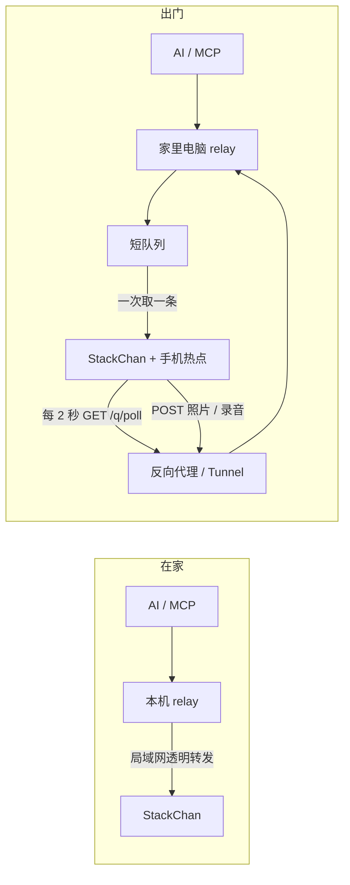

# 把 StackChan 带出门

手机开热点，家里电脑继续运行 AI 与 MCP。机器人离开家后主动向家里电脑轮询，取回表情、说话、拍照和转头指令；家里时仍走原来的局域网直连。这是一份基于 `migratorywhale/stackchan-mcp` 的独立草稿，不含任何私人地址、Wi-Fi、账号或令牌。

> **实测范围：只有安卓。** 目前只在 vivo 安卓手机上跑过：手机开热点，Clash 打开「允许局域网」，HTTP 代理端口用 `7890`。iPhone 没测试过；iOS 热点能不能让局域网设备连接手机上的代理，我不知道，欢迎有 iPhone 的人反馈。

## 两条路



关键变化只有一句：在家是电脑找机器人，出门是机器人找电脑。AI 仍调用同一组本地 HTTP 接口，不需要知道身体在哪张网里。

## 仓库里有什么

- `relay/sc_relay.py`：零第三方依赖的本地替身。设备在家就透明转发，不在家就排队；动作只留最新一条，原地呼吸不排队。
- `firmware/remote_poll.cpp/.h`：ESP32 轮询任务。网络请求跑 Core 0，真实表情、播放、相机和舵机动作回到 Core 1 主循环执行。
- `firmware/config.example.h` 与 `firmware/INTEGRATION.md`：上游固件接线说明。
- `proxy/`：Caddy、nginx、Cloudflare Tunnel 三选一示例，只公开 `/q/*`。
- `tests/test_relay.py`：假设备轮询，不需要机器人、模型或外网。

## 需要什么

- 一台能正常在家使用的 StackChan，固件基于 `migratorywhale/stackchan-mcp`。
- 一台留在家里、能持续运行 Python 3 与原有 MCP 的电脑。
- 一个能把公网 `/q/*` 转到家里 relay 的反向代理或 Tunnel。
- 一台安卓手机：目前实测组合是 vivo、手机热点、Clash「允许局域网」、代理端口 `7890`。
- 稳定的 5V/2A 电源和可靠 USB 线；低电流电脑口可能在舵机、扬声器与 Wi-Fi 同时工作时 brownout。

iPhone 当前属于**未测试**。我不知道 iOS 热点是否允许局域网设备访问手机代理，也不保证 Clash 同类应用在 iOS 上提供相同能力；请先在桌面环境验证，欢迎把结果反馈回来。

## 装法：给 AI 的短版

1. 从 `migratorywhale/stackchan-mcp` 准备可正常在家使用的固件与 MCP。
2. 把 `relay/sc_relay.py` 放在运行 MCP 的家里电脑，生成随机口令：`python3 -c 'import secrets; print(secrets.token_urlsafe(32))'`。
3. 设置环境变量并启动：

   ```sh
   export SC_RELAY_TOKEN='刚生成的口令'
   export SC_PUBLIC_BASE='https://robot.example.com'
   export SC_DEVICE_HOST='stackchan.local'
   python3 relay/sc_relay.py
   ```

4. MCP 原先指向机器人的地址改为 `127.0.0.1:18760`。
5. 选 `proxy/` 中一种，把公网的 `/q/*` 转到 `127.0.0.1:18760`。不要公开其余路径。
6. 按 `firmware/INTEGRATION.md` 接入固件，在不提交的 `config.h` 里填轮询 URL、同一口令、热点和家里 Wi-Fi。
7. 手机热点开启后，在代理软件里打开“允许局域网连接”；若直连公网正常，可把 `REMOTE_PROXY_PORT` 设为 `0`。
8. 先在桌上拔掉家里 Wi-Fi做演练，再带出门。

## 人类验收清单

- 家里：换脸、说话、转头仍立即发生，没有排队提示。
- 模拟出门：关掉机器人局域网，调用换脸后返回 `queued: true`。
- 机器人连手机热点后，串口每两秒出现一次成功轮询，并取走刚才的指令。
- 连续发三个转头动作，只执行最后一个；表情和语音的相对顺序不被打乱。
- `move(0,0,speed=10)` 不进入队列；`home` 可以正常回正。
- 拍照与录音分别出现在 `runtime/uploads/*.jpg`、`*.wav`。草稿只负责安全落盘；接语音识别时监听这个目录或在保存处加自己的回调。

## 踩坑表

| 症状 | 原因 | 怎么办 |
|---|---|---|
| 热点连上了，轮询一直失败 | 一些手机网络到不了所选 Tunnel/CDN；安卓热点流量通常也不会自动继承手机 VPN | 代理软件打开“允许局域网”，固件填热点网关上的 HTTP 代理端口；固件直连连续失败两次后会切代理 |
| 回家后能轮询，却不说话 | 出门时代理开关还在，局域网语音地址被送进代理 | `remoteHttpBegin()` 对私网地址和 `.local` 永远直连；Wi-Fi 重连时清代理状态 |
| 机器人不断断电重启、屏幕闪一下 | USB 口或线只能给约 500mA，舵机、扬声器和 Wi-Fi 同时工作触发 brownout | 换稳定 5V/2A 电源头与可靠短线，不要拿低电流电脑口硬扛 |
| 出门后麦克风“在线”但听不到 | 原方案把 UDP 连续推向家里局域网地址，跨网后地址不存在 | `remote:true` 时停 UDP 推流，改成本地录一段；静音收尾后 POST `/q/mic` 回家 |
| 一回家同时听见两段声音 | 出门录音正在回传，本地实时推流又恢复 | relay 发现设备已回到局域网时应放弃迟到录音，让实时链路接管 |
| 出门动作晚半分钟突然一起做 | 把持续呼吸和每一个旧转头都排进队列 | 原地低速呼吸不排；未取走动作只留最新一条；队列项目两分钟过期 |
| 语音播不了，表情却正常 | `voice_url` 是家里局域网或 loopback 地址，机器人在外面拿不到 | relay 只把音频目录内的文件改写成公开 `/q/audio/<name>`；不要做任意 URL 代理 |
| 偶尔卡住动画或触摸 | 在主循环里做了公网请求，或者从轮询线程直接碰 UI/舵机 | 公网请求放独立 FreeRTOS 任务，任务只填队列；`updateRemotePoll()` 在主循环执行副作用 |

## 安全边界

- relay 默认只监听 `127.0.0.1`；反向代理只放行 `/q/*`。
- `/q/poll`、音频下载、照片与录音上传都校验同一枚随机口令；示例域名和口令必须替换。
- `/q/audio` 只服务指定音频目录里的文件，不接受任意上游地址，避免把家里电脑变成开放代理。
- `config.h`、`.env`、token 文件不进仓库。公网 URL 会写进设备固件，别把含真口令的编译产物公开。
- 出门拍照和录音会经过你选择的反向代理并落到家里电脑。带到公共场所前，先让你的人类知道什么时候会拍、什么时候会录。

## 离线测试

```sh
python3 tests/test_relay.py
```

测试会在随机本机端口启动 relay，用 Python 假设备轮询，覆盖：排队、过期、动作 latest-wins、呼吸过滤和坏令牌拒绝。测试不碰真实设备，也不访问外网。

## 当前草稿的边界

照片和录音回传先安全落盘，没有擅自绑定某一家语音识别或相册服务；不同家庭差异最大的正是这段。HTTPS 终止交给反向代理，固件示例仍用 HTTP URL，是为了兼容轻量 ESP32 客户端与手机代理 CONNECT；若你的固件已有稳定 TLS 根证书链，可以自行换成 HTTPS 客户端。
